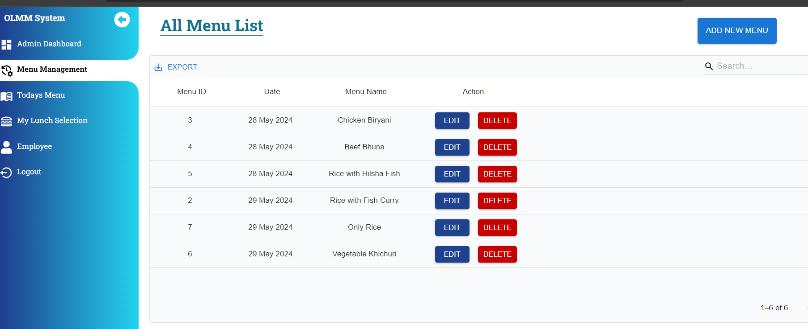

# office-lunch-menu-management [OLMM]

# Live Link 
  ### Client Site : https://olmm-inky.vercel.app/
  ### Server Site : https://olmmserver.vercel.app/

# Login Credentials [email || password]
  - Employee: demo@gmail.com || 110220
  - Admin: demo2@gmail.com || 110220
    
# SnapShort 
###  Admin Site
  ### Dashboard HomePage Show OverAll App Data

  ### Admin Dashboard Show All Sales Data 

  ### Lunch Menu Management

#### Git Commit Messages
- feat: Introducing New Features
- fix: Fixing Bugs
- chore: Miscellaneous Changes
- refactor: Code Refactoring
- docs: Documentation Updates
- style: Code Formatting
- test: Testing Updates
- perf: Performance Improvements
- ci: Continuous Integration
- cd: Continuous Deployment
- build: BuildSystem Updates
- revert: Reverting Changes

## Features
### User Authentication and Authorization
  - Secure user registration and login functionality.
  - Role-based access control for different user types (e.g., customers, admins).

### Menu Management
  - Create, edit, and delete lunch menus.
  - Filtering options for easy browsing.

### Menu Selection  
- Employee Can select his/her menu from list . 
- Menus are automatically filtered by today's date.

### User Management 
- Admin Can create New Employee .
- Employee can select menu by loggin the site.

### Responsive Design
- Mobile-friendly interface for seamless access on various devices.
- Responsive layout for optimal viewing and navigation.

## Technologies Used
- Frontend:TypeScripts,Tailwind CSS,Material-UI
- Backend: Node.js, Express.js,Typescript
- Database: PosgreSQL
- Deployment: Vercel

## Contact Info
  ### Email: hasibul.dcc@gmail.com
  ### Client Site : https://olmm-inky.vercel.app/
  ### Server Site : https://olmmserver.vercel.app/
  ### GitHub: https://github.com/hasibul1670

